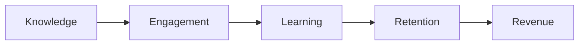

# 01 — Product Vision

**Purpose:** Define the customer, product promise, boundaries, and measures of success  
**Status:** In Review  
**Last Updated:** 2026-07-28  
**Intended Audience:** Founders, product, design, engineering, sales, marketing, and partners

## Contents

1. [Executive summary](#executive-summary)
2. [Vision, mission, and value](#vision-mission-and-value)
3. [Customers and personas](#customers-and-personas)
4. [Jobs and principles](#jobs-and-principles)
5. [Capabilities and positioning](#capabilities-and-positioning)
6. [Boundaries and business model](#boundaries-and-business-model)
7. [Success and validation](#success-and-validation)

## Executive summary

UpNexx is broader than a podcast platform. It is an intelligent content, learning, community, and membership platform for experts and knowledge-based organizations. The product brings media, structured learning, resources, events, community, audience access, and responsible AI into one tenant-branded experience.

The central value journey is:

## Vision, mission, and value

**Vision:** Make valuable expertise easier to discover, learn from, discuss, and sustain.

**Mission:** Give creators and organizations one professional platform to turn trusted knowledge into recurring member value.

**Value proposition:** UpNexx replaces disconnected content, course, community, event, membership, and AI tools with a coherent experience controlled by the tenant’s brand and access rules.

**Approved message:** Transform your expertise into engagement, learning, and revenue.

### Customer problems

- Expertise is fragmented across feeds, drives, course tools, social platforms, and event links.
- Audiences consume content but lack a clear next step.
- Small teams repeat content-production and member-support work.
- Organizations cannot easily connect engagement, learning progress, retention, and revenue.
- Generic AI tools lack tenant context, authorization, citations, and predictable cost controls.

## Customers and personas

### Target segments

Podcasters, educators, coaches, consultants, churches, authors, speakers, associations, nonprofits, and other knowledge-based organizations. Initial focus should favor customers with an existing content library, recurring audience, and clear membership or learning outcome.

### Primary personas

| Persona | Need | Current repository support |
| --- | --- | --- |
| Platform administrator | Provision and oversee tenants | **Partial:** tenant wizard and platform views exist; operations remain incomplete |
| Tenant owner/administrator | Brand, publish, manage access, and measure value | **Partial:** core management exists; billing and full analytics do not |
| Content manager | Publish episodes, courses, resources, and events | **Implemented/Partial:** CRUD and storage exist; deep course authoring is partial |
| Community moderator | Guide discussion and member safety | **Partial:** schema and basic spaces exist; moderation workflows are planned |
| Member/learner | Watch, learn, join events, and access resources | **Partial:** tenant/member views exist; personalization and progress depth are incomplete |
| Buyer/sponsor | Evaluate value, pricing, and operational fit | **Partial:** marketing and plan presentation exist; proof and billing are not complete |

## Jobs and principles

### Jobs to be done

- “Help me turn existing expertise into a structured member journey.”
- “Give my audience one trusted destination instead of scattered links.”
- “Let me charge for appropriate access without confusing platform fees and memberships.”
- “Help my team repurpose content without inventing facts.”
- “Help members find the next useful episode, lesson, event, or discussion.”
- “Show me which content and members need attention.”

### Product principles

1. **Tenant safety first:** every customer-owned record is tenant scoped.
2. **One clear next step:** content should lead to learning, discussion, action, or membership.
3. **Human-centered AI:** authorized sources, citations, review, and cost controls precede automation.
4. **Useful before expansive:** first-customer readiness outranks advanced enterprise breadth.
5. **White-label without ambiguity:** tenant identity is primary in tenant experiences; UpNexx attribution remains appropriate.
6. **Business and technical clarity:** platform subscriptions and audience memberships are separate.
7. **Accessible and responsive:** core workflows must work with keyboard, assistive technology, and mobile layouts.

## Capabilities and positioning

### Core platform capabilities

- **Implemented or partial:** multi-tenant accounts, tenant branding, role-aware administration, podcasts/video, course records, resources, events, community spaces, audience membership plans, tenant subscription records, content access rules, storage, creator AI generation, tenant-owned encrypted AI credentials, usage/credit schema, public/member views, onboarding tour.
- **Planned:** member RAG assistant, recommendation delivery, administrator AI insights, full course/quiz authoring, Stripe checkout/webhooks/portal, Resend delivery, operational custom domains, production analytics and monitoring, mobile applications, marketplace, public API.

### Competitive positioning

UpNexx sits between creator membership platforms, learning-management systems, community platforms, podcast hosting/member tools, and AI content assistants. Its intended differentiation is a unified, tenant-aware journey from source content to learning, community, retention, and revenue—not best-of-breed replacement for every specialist tool in Version 1.0.

## Boundaries and business model

### Product boundaries

- UpNexx hosts and organizes member experiences; it is not currently a full podcast distribution network.
- UpNexx may store Stripe identifiers but does not yet execute billing.
- AI generation is source-guided but member retrieval/citations are not yet delivered.
- Custom-domain records and resolution exist; automated DNS verification and certificates do not.
- Tenant white labeling does not remove platform governance, security, or data-isolation requirements.

### Version 1.0 non-goals

- Native iOS/Android applications
- Marketplace and third-party developer ecosystem
- Enterprise SSO/SCIM
- Full marketing automation suite
- Advanced video transcoding or podcast feed distribution
- Formal compliance certification
- Autonomous AI publishing without human approval

### Business model

The proposed model combines:

1. a platform subscription paid by each tenant to UpNexx; and
2. audience memberships sold by the tenant to its members.

Creator, Growth, Professional, Enterprise, Trial, Complimentary, and Custom platform plans are represented in product logic or schema, but price points and limits require validation. See [Subscription and Membership Model](11_Subscription_and_Membership_Model.md).

### Long-term vision

An extensible intelligence layer that understands authorized tenant knowledge, member goals, engagement, and commercial context—supporting personalized learning, creator productivity, retention action, integrations, APIs, and a responsible marketplace.

## Success and validation

### Candidate success metrics

| Outcome | Metric | Status |
| --- | --- | --- |
| Activation | Tenant reaches branding + first published content + first invited member | Needs baseline |
| Engagement | Weekly active members and content completion | Instrumentation planned |
| Learning | Lesson/course progress and learning-path completion | Partial schema |
| Retention | 30/60/90-day member retention and churn | Planned |
| Revenue | Tenant MRR, audience MRR, conversion, and expansion | Billing planned |
| AI value | Accepted generations, cited answers, cost per successful task | Partial metering |
| Reliability | Error rate, availability, recovery time | Monitoring planned |

### Assumptions requiring validation

- Customers prefer a unified platform over connecting specialist tools.
- The initial segments share enough workflow to support one product.
- Tenant BYO AI keys are acceptable to early customers.
- Proposed plan pricing and limits align with willingness to pay.
- Members will adopt a source-grounded assistant when citations and permissions are visible.
- First customers need operational custom domains before public launch.

## Open questions

- Which segment and use case define the first-customer wedge?
- Which capabilities are mandatory for the first paid contract?
- Will audience billing use one platform Stripe account or Stripe Connect?
- What proof is required before expanding beyond the first segment?

## Related documents

[Roadmap](07_Product_Roadmap.md) · [Go-to-Market](08_Go_To_Market_Strategy.md) · [Subscription Model](11_Subscription_and_Membership_Model.md) · [Glossary](15_Product_Glossary.md)

