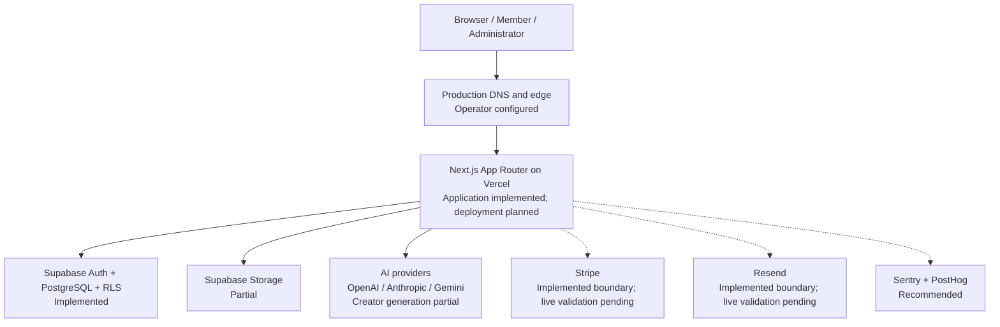
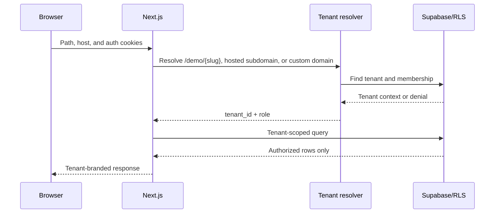
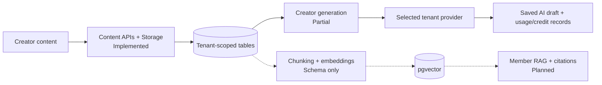
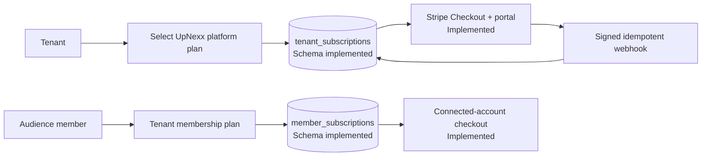

# 03 — System Architecture

**Purpose:** Describe the repository-supported architecture and the intended production architecture  
**Status:** In Review  
**Last Updated:** 2026-07-28  
**Intended Audience:** Engineering, security, operations, product, and technical partners

## Contents

1. [High-level architecture](#high-level-architecture)
2. [Application layers](#application-layers)
3. [Tenant-aware request flow](#tenant-aware-request-flow)
4. [Authentication and authorization](#authentication-and-authorization)
5. [Content, AI, and billing](#content-and-ai-workflow)
6. [Reliability and gaps](#scalability-reliability-and-error-handling)

## Status notation

- **[Implemented]** evidenced in code or migrations
- **[Partial]** foundation exists but the production workflow is incomplete
- **[Planned]** represented in direction/schema but not delivered
- **[Recommended]** a proposed control or service requiring approval

## High-level architecture



## Application layers

| Layer | Current implementation | Status |
| --- | --- | --- |
| Frontend | Next.js 15 App Router, React 19, TypeScript, Tailwind, local UI components | Implemented |
| Server | Server Components, Server Actions, route handlers, middleware | Implemented |
| Authentication | Supabase password authentication and cookie refresh | Implemented |
| Authorization | Platform roles, tenant membership/roles, server checks, RLS helpers, production isolation evidence | Implemented; live production matrix pending |
| Database | PostgreSQL migrations with tenant-scoped relational model | Implemented in repository; live migration state must be verified |
| Storage | `tenant-assets` bucket and tenant-folder policies | Partial |
| AI | Direct provider adapters inside generation route; encrypted tenant keys | Partial |
| Billing | Separate platform and audience checkout, portal, Connect, signed idempotent webhooks, and reconciliation | Implemented; live production configuration pending |
| Email | Resend provider boundaries, signed webhooks, encrypted durable delivery, retries, and reconciliation | Implemented; live production configuration pending |
| Analytics | Dashboard mock/summary views and usage schema | Partial; PostHog absent |
| Monitoring | Framework logs only | Recommended; Sentry absent |
| Hosting | Vercel-compatible Next.js configuration | Planned/Needs Validation |
| DNS | Ownership challenges, live route checks, verified resolution, SSL evidence, canonical activation, and rollback | Implemented; external production proof pending |

Sentry and PostHog are not installed. External monitoring and product-analytics selection remain operator/product decisions.

## Tenant-aware request flow



`tenant_id` is the isolation boundary. Slugs and domains locate a tenant but do not replace the tenant UUID.

## Authentication and authorization

```mermaid
flowchart LR
  A[Email/password] --> B[Supabase Auth]
  B --> C[HttpOnly session cookies]
  C --> D[Next.js middleware]
  D -->|Unauthenticated| E[/login]
  D -->|Authenticated| F[Server context]
  F --> G{Authority}
  G -->|Platform role| H[Platform administration]
  G -->|Tenant manager| I[Tenant administration]
  G -->|Member| J[Authorized member content]
  G -->|No assignment| K[Access denied]
```

Middleware protects `/dashboard/*` and `/platform-admin/*`. Server helpers must still authorize every data mutation; middleware alone is not an authorization boundary.

## Content and AI workflow



Creator AI generation supports readable tenant-scoped sources, trusted server resolution, multiple output types, atomic credit reservation, and versioned Content Library drafts. RAG tables and vector extension exist in migrations, but ingestion, authorized retrieval, citations, and member-assistant delivery remain planned.

## Subscription billing flow



Platform subscriptions and audience memberships must remain separate in routes, tables, reporting, and customer language.

## Data flow and external integrations

- Browser clients receive only the Supabase public URL and anonymous key.
- Service-role and encryption keys remain server only.
- Tenant AI credentials are encrypted with AES-256-GCM before database storage.
- Provider calls occur from a Node route; keys are not returned to browsers.
- Storage paths begin with tenant identifiers and use storage policies.
- Stripe and Resend application boundaries are implemented, but live credentials, provider configuration, webhook delivery, and production evidence remain operator work. DNS/provider automation, Sentry, and PostHog are not claimed.

## Scalability, reliability, and error handling

### Current

- Server-rendered pages and route handlers
- Database indexes on tenant IDs and key subscription/provider relationships
- RLS and tenant-scoped queries
- Client loading/error states for primary content management
- Framework build, test, and trace support

### Recommended before scale

- Queue/background worker for embeddings, email, imports, and webhooks
- Idempotency for billing, invitations, and AI usage writes
- Structured logs with request, tenant, and trace IDs—but no secrets or prompts by default
- Sentry error capture and PostHog consent-aware product analytics
- Rate limits for auth, uploads, AI, invites, and public forms
- Timeouts, retries with backoff, circuit breakers, and provider fallback rules
- Health checks, alerting, backup verification, and rollback runbooks
- Cache policy defined per public, tenant, and user-specific response

## Known architectural gaps

- Production billing and signed webhook boundaries are implemented but require live configuration and controlled production verification. Production email, monitoring, and product-analytics integrations remain incomplete.
- No background jobs or durable event queue.
- Advanced vector ingestion and semantic ranking remain incomplete; authorized member citations, deterministic recommendations, and qualified administrator insight generation are implemented.
- Database-generated TypeScript types may not reflect every migration.
- Custom-domain ownership and DNS checks, verified-host routing, canonical redirects, certificate evidence, activation, and rollback controls are implemented; live provider issuance and production evidence remain operator responsibilities.
- Live RLS/tenant-isolation testing is not automated against staging.
- Recovery objectives and operational ownership are undefined.

## Open questions

- Will audience payments use Stripe Connect, destination charges, or a manual first-customer process?
- Which job/queue platform will support ingestion and outbound notifications?
- What production region, availability, RPO, and RTO are required?
- Which logs and analytics events may include tenant/user identifiers?

## Related documents

[Database Design](04_Database_Design.md) · [AI Architecture](05_AI_Architecture.md) · [Security and Privacy](12_Security_and_Privacy.md) · [Deployment](13_Deployment_and_Environment_Setup.md)
