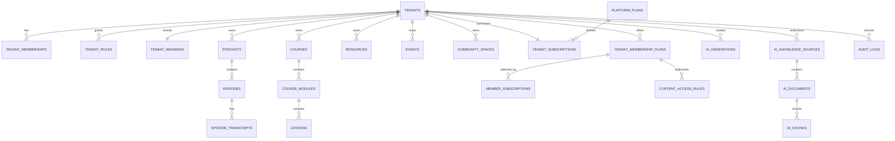

# 04 — Database Design

**Purpose:** Document the Supabase/PostgreSQL data model, isolation controls, and schema gaps  
**Status:** In Review  
**Last Updated:** 2026-07-28  
**Intended Audience:** Backend developers, security reviewers, data engineers, and technical operators

## Contents

1. [Repository basis](#repository-basis)
2. [Entity inventory](#entity-inventory)
3. [Core relationships](#core-relationships)
4. [Tenant isolation and RLS](#tenant-isolation-and-rls)
5. [Storage, indexes, and constraints](#storage)
6. [Migration, retention, and gaps](#migration-strategy)

## Repository basis

This document audits migrations `0001_initial.sql` through `0006_subscription_membership_ai_foundation.sql`. A migration existing in the repository does not prove that it has been applied to every environment.

## Design conventions

- UUID primary keys and `timestamptz` timestamps
- `tenant_id` on customer-owned data
- foreign keys with explicit delete behavior
- snake_case database names
- status/access values constrained where migrations specify them
- RLS enabled with helper functions such as `is_platform_admin`, `is_tenant_member`, `can_manage_tenant`, and `has_content_access`
- migrations applied in numeric order; production changes should be additive and reversible where practical

## Entity inventory

### Identity, tenants, and administration

| Tables | Purpose | Status |
| --- | --- | --- |
| `tenants`, `tenant_domains`, `tenant_branding` | Organization, routing, and white-label identity | Implemented |
| `profiles`, `tenant_memberships`, `tenant_roles`, `tenant_invitations` | Users, tenant assignment, roles, and invitations | Implemented/Partial workflows |
| `audit_logs`, `support_requests`, `feature_flags`, `usage_metrics`, `notifications` | Platform operations | Schema implemented; product workflows partial/planned |

`auth.users` is managed by Supabase. Application profiles and tenant memberships refer to authenticated users.

### Content and learning

| Tables | Purpose | Status |
| --- | --- | --- |
| `podcasts`, `episodes` | Podcast containers and episodes | Implemented |
| `episode_guests`, `episode_tags`, `episode_resources`, `episode_transcripts`, `episode_comments` | Episode enrichment | Schema implemented; UI/workflows partial |
| `courses`, `course_modules`, `lessons`, `lesson_resources` | Structured learning | Schema implemented; deep authoring partial |
| `course_enrollments`, `lesson_progress` | Enrollment and progress | Schema implemented; member workflow partial |
| `resources` | Tenant files/links | Implemented by migration 0004 and content API |
| `events`, `event_registrations`, `event_replays` | Live and replay experiences | Event CRUD implemented; registration/replay partial |
| Quiz tables | Quizzes and assessment | **Proposed:** not present in current migrations |

`podcast_episodes` in migration 0001 is an earlier prototype table. Current application content uses `podcasts` and `episodes`; a migration/retirement decision is required.

### Community

`community_spaces`, `community_posts`, `community_comments`, and `community_reactions` provide a tenant-scoped discussion model. Space management is present; full member posting, moderation, reporting, and notification workflows remain partial/planned.

### Platform subscriptions and audience memberships

| Layer | Tables | Meaning |
| --- | --- | --- |
| Platform subscription | `platform_plans`, `platform_plan_features`, `tenant_subscriptions`, `tenant_feature_entitlements` | What a tenant buys from UpNexx |
| Audience membership | `tenant_membership_plans`, `membership_plan_features`, `content_access_rules`, `membership_ai_allowances`, `member_subscriptions` | What a tenant offers its members |
| Billing records | `payments`, `billing_events` | Provider/payment history foundation |

The two subscription layers are intentionally separate. Stripe identifiers exist as reference columns, but Stripe execution is not implemented.

### AI and intelligence

| Tables | Purpose | Status |
| --- | --- | --- |
| `ai_provider_settings`, `tenant_ai_settings` | Encrypted tenant provider configuration and AI preferences | Implemented/Partial |
| `ai_knowledge_sources`, `ai_documents`, `ai_chunks` | RAG source, document, chunk, and vector storage | Schema implemented; ingestion/retrieval planned |
| `ai_conversations`, `ai_messages` | Member conversation history | Schema implemented; assistant planned |
| `ai_usage`, `tenant_ai_usage`, `tenant_ai_credit_transactions`, `ai_feature_credit_config` | Usage and credit metering | Implemented/Partial |
| `ai_generations` | Saved creator AI drafts | Implemented |
| `member_recommendations` | Explainable ranked member suggestions and feedback | Implemented baseline |
| `administrator_ai_insights` | Qualified administrative findings and human review | Implemented baseline |
| `data_rights_requests` | Member export/correction/closure request lifecycle | Implemented baseline |

`pgvector` is created in migration 0002 and `ai_chunks.embedding` uses a 1536-dimension vector. Model compatibility, index type, ingestion jobs, and retrieval queries must be decided before production use.

## Core relationships

The diagram intentionally omits exact columns. Refer to migrations for the executable schema.

## Tenant isolation and RLS

- Tenant-owned tables use non-null tenant foreign keys where defined.
- Policy loops in migrations enable RLS and create member-read/manager-write policies.
- Content policies combine publication, access level, membership, and server-side `has_content_access`.
- User-specific records restrict reads to the owner where explicit policies exist.
- Storage policies derive tenant context from the first path segment.

**Needs Validation:** execute a multi-role staging test matrix. Static migration tests confirm policy text exists but do not prove deployed behavior.

## Storage

`tenant-assets` is a public bucket with a 100 MB file limit in migration 0004. Tenant managers write under `{tenant_id}/...`; members may read tenant-scoped objects.

Before production:

- validate whether public bucket semantics meet paid-content requirements;
- use signed/private delivery for restricted assets;
- define MIME allowlists, malware scanning, quotas, deletion, and orphan cleanup;
- confirm storage policy behavior with authenticated staging tests.

## Indexes and constraints

Repository migrations include:

- tenant-ID indexes generated for tenant-scoped tables;
- a unique tenant subscription per tenant;
- provider-settings tenant index;
- resources tenant index;
- foreign keys and several status/type check constraints.

Potential gaps requiring query-plan review:

- composite indexes for tenant + status + publish date;
- query-plan review for custom-domain resolution as production volume grows (normalized hostname uniqueness is enforced);
- vector index choice (HNSW/IVFFlat) after retrieval design;
- idempotency keys for billing events/webhooks;
- uniqueness rules for active audience subscriptions;
- constraints preventing cross-tenant foreign-key combinations.

## Retention, backup, and recovery

**Recommended:**

- define retention by record type, contract, and legal obligation;
- export/delete user data through a controlled tenant-aware workflow;
- configure Supabase backups and periodically prove restoration;
- document RPO/RTO and disaster-recovery ownership;
- retain audit and billing records separately from removable content where lawful;
- avoid storing unnecessary provider prompts/responses.

## Migration strategy

1. Apply migrations in order to a non-production environment.
2. Verify schema, RLS, functions, storage policies, and generated types.
3. Backfill separately from schema changes.
4. Run tenant-isolation and application smoke tests.
5. Record applied version and rollback/forward-fix plan.
6. Never edit a migration already applied to shared environments; add a new migration.

## Known gaps

- Live migration state is not recorded in the repository.
- Generated Supabase TypeScript types need reconciliation with migrations 0004–0006.
- Quiz/assessment and richer activity-event tables are absent.
- Vector ingestion and retrieval are not implemented.
- Billing tables are not connected to signed provider webhooks.
- Earlier `podcast_episodes` and current `episodes` overlap.

## Open questions

- Should paid assets move to a private bucket?
- What is the canonical member-activity event schema?
- Which embedding model/dimension and vector index will be standard?
- What retention and deletion guarantees will contracts require?

## Related documents

[System Architecture](03_System_Architecture.md) · [AI Architecture](05_AI_Architecture.md) · [Subscription Model](11_Subscription_and_Membership_Model.md) · [Security](12_Security_and_Privacy.md)
