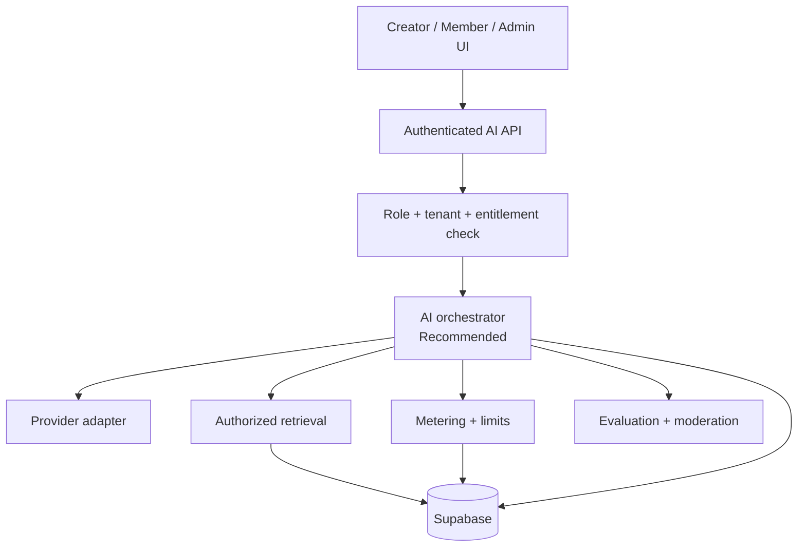
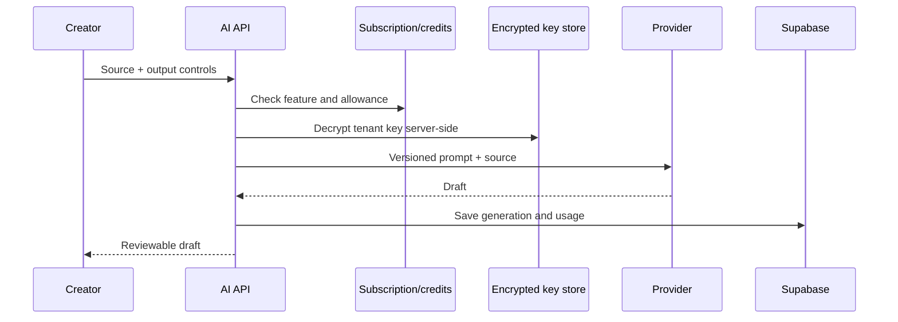
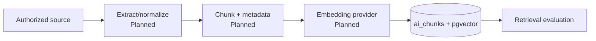
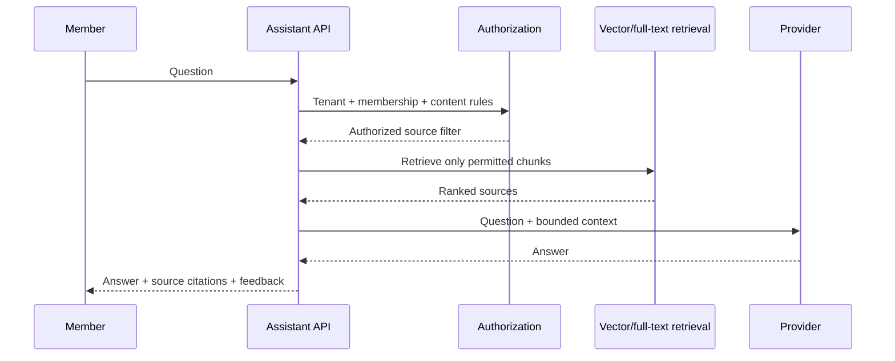
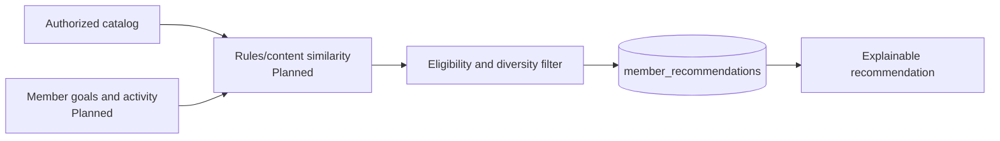
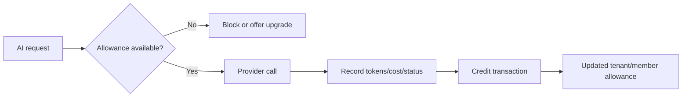

# 05 — AI Architecture

**Purpose:** Define safe, tenant-aware AI capabilities, delivery phases, and operational controls  
**Status:** In Review  
**Last Updated:** 2026-07-28  
**Intended Audience:** Product, AI/backend engineering, security, finance, and customer success

## Contents

1. [Current status](#current-status)
2. [Capability map](#capability-map)
3. [Target service layer](#target-service-layer)
4. [Generation, ingestion, and member AI](#creator-generation-workflow)
5. [Metering and safety](#metering-and-cost)
6. [Evaluation and rollout](#evaluation-strategy)

## Current status

- **Implemented/Partial:** tenant BYO provider key storage, AES-256-GCM encryption, OpenAI/Anthropic/Google provider calls, creator source-to-draft generation, saved generations, credit checks/usage schema.
- **Schema only/Planned:** vector ingestion, member conversations, recommendations, administrator insights.
- **Not installed:** Vercel AI SDK.

Provider logic currently lives in `app/api/ai/generate/route.ts`, not a standalone abstraction package. A dedicated service layer is recommended before expanding AI features.

## Capability map

### Creator AI Studio

The interface and output schema support episode summaries, show notes, blog posts, LinkedIn/Facebook posts, Instagram captions, X posts, email newsletters, episode topics, quiz questions, discussion questions, event descriptions, and promotional copy. These are **partial** until provider-specific output validation, evaluation, moderation, and publishing review are complete.

### Member AI

Planned capabilities: authorized content Q&A, episode/course/event/resource recommendations, learning paths, episode summaries, next-lesson suggestions, and related discussions. Current member AI pages are placeholders; no production RAG/citation workflow exists.

### Administrator AI

Planned: disengagement detection, retention campaign suggestions, topic/opportunity analysis, community summaries, and unanswered-question detection. Tables exist for insights but no operational generation or review workflow is implemented.

## Target service layer

The orchestrator should own prompt versions, structured outputs, timeouts, retries, fallback policy, citations, metering, and audit metadata.

## Provider strategy

- Supported direction: OpenAI, Anthropic Claude, and Google Gemini.
- Tenant chooses a provider/model and supplies a key where BYO is enabled.
- Maintain capability metadata rather than assuming every model supports the same context, structured output, moderation, or price.
- Model changes require evaluation, cost review, and a decision-log entry.
- A platform-managed key option may be introduced only with billing, quotas, and contractual controls.

## Creator generation workflow

Human review is required before publishing. Source text should remain available if generation fails.

## Content ingestion and embedding

Recommended metadata: tenant, source type/id, access level, membership rules, language, version, checksum, timestamps, and deletion state. Chunk sizes and overlap must be validated by content type; do not standardize by guesswork.

## Member question-answering

No answer should cite or reveal a source the member cannot open. If retrieval confidence is low, the assistant should say it cannot answer from authorized content.

## Recommendations

Begin with deterministic rules and content similarity before opaque behavioral ranking. Provide “why recommended,” dismiss, and feedback controls.

## Metering and cost

Track provider, model, input/output tokens where available, estimated provider cost, credits charged, feature, status, tenant, user, and source—not raw secrets. Make usage writes idempotent.

## Safety and quality controls

- **Authorization:** tenant and content access filters before retrieval.
- **Grounding:** source-bounded prompts and visible citations.
- **Hallucination:** refuse unsupported claims; test factual faithfulness.
- **Moderation:** input/output policy appropriate to customer segment; escalation path.
- **Prompt management:** version prompts and structured-output schemas.
- **Rate limiting:** tenant, user, feature, and IP layers.
- **Caching:** only for tenant/user/authorization-equivalent requests; never cross tenant.
- **Privacy:** define retention; avoid training-provider use where contracts permit; redact unnecessary personal data.
- **Human review:** creator output remains draft; administrative insights require confirmation.
- **Feedback:** capture helpful/not helpful, correction reason, citation issues, and dismissals.

## Fallback behavior

1. Do not silently switch to a provider the tenant has not authorized.
2. Retry only safe, idempotent requests with bounded backoff.
3. Preserve inputs and explain failure without exposing provider secrets.
4. If credits cannot be recorded, fail closed or reconcile through an idempotent pending record.
5. Member assistant falls back to search/browse rather than ungrounded general answers.

## Evaluation strategy

- Curated tenant-separated test sets
- Groundedness, citation correctness, retrieval recall/precision, refusal quality
- Structured-output validity and brand/tone adherence
- Safety and prompt-injection tests
- Latency, provider failure, token, credit, and cost tests
- Human acceptance rate and correction rate
- Regression gate for provider/model/prompt changes

## Phased rollout

1. **Creator generation hardening:** evaluation, structured output, moderation, retry/idempotency.
2. **Ingestion and retrieval:** source lifecycle, authorized filters, retrieval evaluation.
3. **Member assistant beta:** citations, feedback, strict allowances.
4. **Recommendations:** deterministic baseline, explanations, feedback.
5. **Administrator insights:** human-reviewed actions, privacy safeguards.
6. **Provider optimization:** routing/fallback only after consent and evidence.

## Known risks and gaps

- Direct provider code is duplicated in one route rather than a formal adapter layer.
- Google generation support must be verified end to end.
- No ingestion worker, citation interface, prompt registry, moderation layer, or evaluation harness.
- Credit metering is partial and needs concurrency/idempotency validation.
- AI privacy terms and provider data-processing settings are unapproved.

## Open questions

- Which provider/model is the supported Version 1.0 default?
- Who pays provider costs under BYO and platform-managed modes?
- What content types, languages, and retention periods are in first scope?
- What confidence threshold triggers refusal?

## Related documents

[System Architecture](03_System_Architecture.md) · [Database Design](04_Database_Design.md) · [Security and Privacy](12_Security_and_Privacy.md) · [Testing and QA](14_Testing_and_Quality_Assurance.md)
