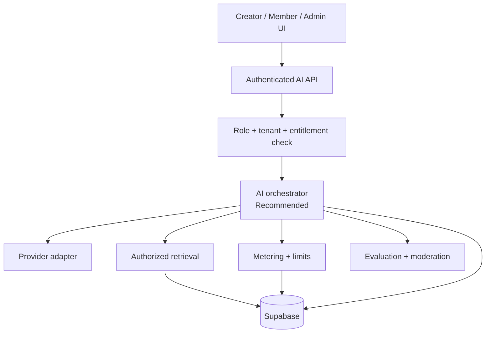
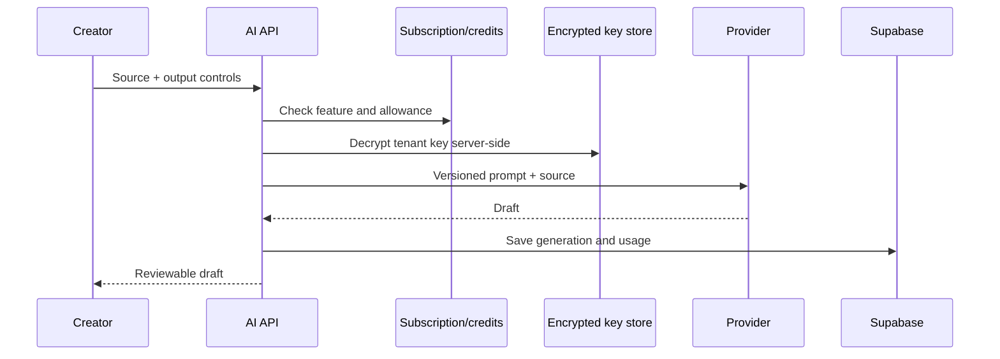
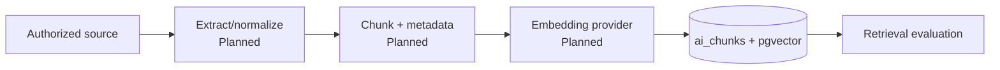
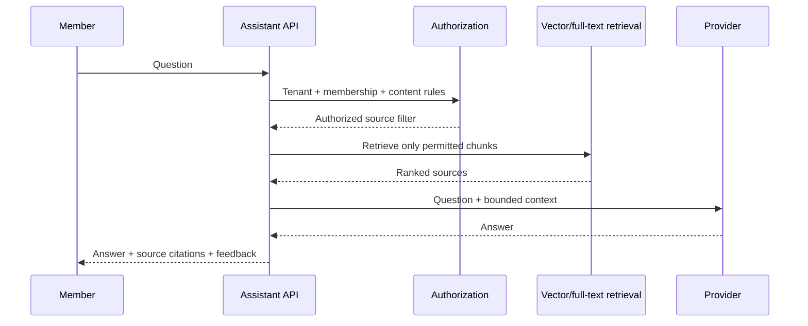
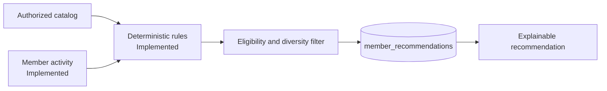
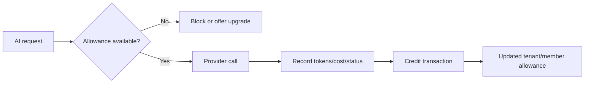

# 05 — AI Architecture

**Purpose:** Define safe, tenant-aware AI capabilities, delivery phases, and operational controls  
**Status:** In Review  
**Last Updated:** 2026-07-28  
**Intended Audience:** Product, AI/backend engineering, security, finance, and customer success

## Contents

1. [Current status](#current-status)
2. [Capability map](#capability-map)
3. [Target service layer](#target-service-layer)
4. [Generation, ingestion, and member AI](#creator-generation-workflow)
5. [Metering and safety](#metering-and-cost)
6. [Evaluation and rollout](#evaluation-strategy)

## Current status

- **Implemented/Partial:** per-tenant OpenAI/Anthropic/Google configurations, AES-256-GCM credential encryption, tenant/platform context authorization, connection verification, provider adapters, readable tenant-scoped Creator AI sources, trusted source-to-draft generation, versioned Content Library drafts, atomic credit reservation/usage records, authorized member Q&A with citations, deterministic recommendations, and qualified administrator insights.
- **Schema only/Planned:** vector ingestion and semantic similarity ranking.
- **Not installed:** Vercel AI SDK.

Provider logic is centralized in `lib/ai/provider-adapters.ts`; tenant generation resolves an enabled, verified default through `lib/ai/tenant-ai-service.ts`. No platform-wide provider fallback is used.

## Capability map

### Creator AI Studio

The interface and output schema support episode summaries, show notes, blog posts, LinkedIn/Facebook posts, Instagram captions, X posts, email newsletters, episode topics, quiz questions, discussion questions, event descriptions, and promotional copy. Sources are selected by readable tenant title and re-resolved server-side; edited outputs retain version history. The capability remains **partial** until provider-specific output validation, evaluation, moderation, and live-provider review are complete.

### Member AI

Authorized content Q&A with citations and deterministic episode/course/event/resource/community recommendations are implemented. Recommendations disclose why they were selected and accept dismiss/helpfulness feedback. Semantic similarity, learning paths, and more advanced behavioral ranking remain planned.

### Administrator AI

Qualified operational signals are implemented for audience risk flags, learning completion, event attendance, email delivery, and recent community activity. They expose supporting counts and limitations and require an authorized person to review, dismiss, or reopen them. Provider-generated forecasting and autonomous action remain out of scope.

## Target service layer

The orchestrator should own prompt versions, structured outputs, timeouts, retries, fallback policy, citations, metering, and audit metadata.

## Provider strategy

- Supported direction: OpenAI, Anthropic Claude, and Google Gemini.
- Tenant owners and tenant administrators manage only their current workspace at **Organization Settings → Integrations → AI Providers**.
- Platform owners and platform administrators manage only the tenant deliberately opened in Platform Admin.
- A user holding both role types receives authority from the current interface context; platform status never expands a tenant-context request.
- Tenants may store multiple provider configurations, with at most one default.
- Generation requires the default configuration to be enabled and successfully verified.
- Maintain capability metadata rather than assuming every model supports the same context, structured output, moderation, or price.
- Model changes require evaluation, cost review, and a decision-log entry.
- A platform-managed key option may be introduced only with billing, quotas, and contractual controls.

## Credential lifecycle and isolation

1. The browser sends a candidate credential over HTTPS to an authenticated server route.
2. The server derives the tenant from the current tenant workspace, or requires an explicit selected tenant in platform context.
3. The server encrypts the key with AES-256-GCM, a unique 96-bit nonce, and `APP_ENCRYPTION_KEY`.
4. The credential table has RLS enabled and all access revoked from `anon` and `authenticated`; only trusted server code may read ciphertext.
5. Responses include provider, model, status, verification timestamps, and last four characters only. Ciphertext and plaintext are never returned.
6. Replacing a key clears verification until the stored replacement is tested. Disabling or removing a provider prevents generation with it.

Missing `tenant_can_manage_ai_credentials` means tenant administrators may manage their own keys. A platform administrator may set this tenant-scoped flag to `false`, making the tenant screen read-only without changing platform-context authority.

Connection tests use the selected provider/model and return normalized error codes. Logs and audit records contain tenant, actor, role, context, provider, model, action, success, and safe error codes—never credential material.

## Administrator workflows

- **Tenant:** Organization Settings → Integrations → AI Providers. The server derives the current tenant from the authenticated owner/admin membership and ignores platform authority in this context.
- **Platform:** Platform Admin → Tenants → selected tenant → AI Configuration. Every request includes the deliberately selected tenant and separately requires a platform owner/admin role.
- **Provisioning:** the tenant wizard can enable tenant-managed AI, defer secure platform configuration until immediately after creation, or disable AI. Credentials are never collected in provisioning summaries, emails, or URLs.
- **First Hour Experience:** the dashboard AI Quick Start checks for an enabled, verified default. Administrators can configure and return to Quick Start; other users receive the unavailable message; Skip for Now leaves all other onboarding progress unchanged.

### Operations and incident response

- Configure `APP_ENCRYPTION_KEY` and `SUPABASE_SERVICE_ROLE_KEY` as server-only secrets in every runtime environment.
- Keep `APP_ENCRYPTION_KEY` stable; rotating it requires decrypting and re-encrypting every stored credential under a controlled migration.
- If the encryption key is lost or suspected compromised, disable tenant AI generation, rotate the server secret, mark configurations as requiring replacement, notify affected tenant administrators, and require new provider keys.
- If a tenant provider key is suspected compromised, disable that provider, revoke it at the provider, replace it in UpNexx, test the stored replacement, and review tenant audit/usage records.
- Never paste provider credentials into source, tickets, logs, documentation, screenshots, or browser-visible environment variables.

## Creator generation workflow

Human review is required before publishing. Source text should remain available if generation fails.

## Content ingestion and embedding

Recommended metadata: tenant, source type/id, access level, membership rules, language, version, checksum, timestamps, and deletion state. Chunk sizes and overlap must be validated by content type; do not standardize by guesswork.

## Member question-answering

No answer should cite or reveal a source the member cannot open. If retrieval confidence is low, the assistant should say it cannot answer from authorized content.

## Recommendations

Begin with deterministic rules and content similarity before opaque behavioral ranking. Provide “why recommended,” dismiss, and feedback controls.

## Metering and cost

Track provider, model, input/output tokens where available, estimated provider cost, credits charged, feature, status, tenant, user, and source—not raw secrets. Make usage writes idempotent.

## Safety and quality controls

- **Authorization:** tenant and content access filters before retrieval.
- **Grounding:** source-bounded prompts and visible citations.
- **Hallucination:** refuse unsupported claims; test factual faithfulness.
- **Moderation:** input/output policy appropriate to customer segment; escalation path.
- **Prompt management:** version prompts and structured-output schemas.
- **Rate limiting:** tenant, user, feature, and IP layers.
- **Caching:** only for tenant/user/authorization-equivalent requests; never cross tenant.
- **Privacy:** define retention; avoid training-provider use where contracts permit; redact unnecessary personal data.
- **Human review:** creator output remains draft; administrative insights require confirmation.
- **Feedback:** capture helpful/not helpful, correction reason, citation issues, and dismissals.

## Fallback behavior

1. Do not silently switch to a provider the tenant has not authorized.
2. Retry only safe, idempotent requests with bounded backoff.
3. Preserve inputs and explain failure without exposing provider secrets.
4. If credits cannot be recorded, fail closed or reconcile through an idempotent pending record.
5. Member assistant falls back to search/browse rather than ungrounded general answers.

## Evaluation strategy

- Curated tenant-separated test sets
- Groundedness, citation correctness, retrieval recall/precision, refusal quality
- Structured-output validity and brand/tone adherence
- Safety and prompt-injection tests
- Latency, provider failure, token, credit, and cost tests
- Human acceptance rate and correction rate
- Regression gate for provider/model/prompt changes

## Phased rollout

1. **Creator generation hardening:** evaluation, structured output, moderation, retry/idempotency.
2. **Ingestion and retrieval:** source lifecycle, authorized filters, retrieval evaluation.
3. **Member assistant beta:** citations, feedback, strict allowances.
4. **Recommendations:** deterministic baseline, explanations, feedback.
5. **Administrator insights:** human-reviewed actions, privacy safeguards.
6. **Provider optimization:** routing/fallback only after consent and evidence.

## Known risks and gaps

- Live provider verification and generation must be validated against staging provider accounts.
- The current tenant workspace resolver selects the active tenant membership supplied by the application shell; a future multi-workspace selector must preserve the same server-derived context.
- Provisioning’s “configure securely after creation” option opens the selected tenant’s AI screen; it intentionally does not place an API key input inside the general provisioning form.
- No ingestion worker, citation interface, prompt registry, moderation layer, or evaluation harness.
- Credit metering is partial and needs concurrency/idempotency validation.
- AI privacy terms and provider data-processing settings are unapproved.

## Open questions

- Which provider/model is the supported Version 1.0 default?
- Who pays provider costs under BYO and platform-managed modes?
- What content types, languages, and retention periods are in first scope?
- What confidence threshold triggers refusal?

## Related documents

[System Architecture](03_System_Architecture.md) · [Database Design](04_Database_Design.md) · [Security and Privacy](12_Security_and_Privacy.md) · [Testing and QA](14_Testing_and_Quality_Assurance.md)
