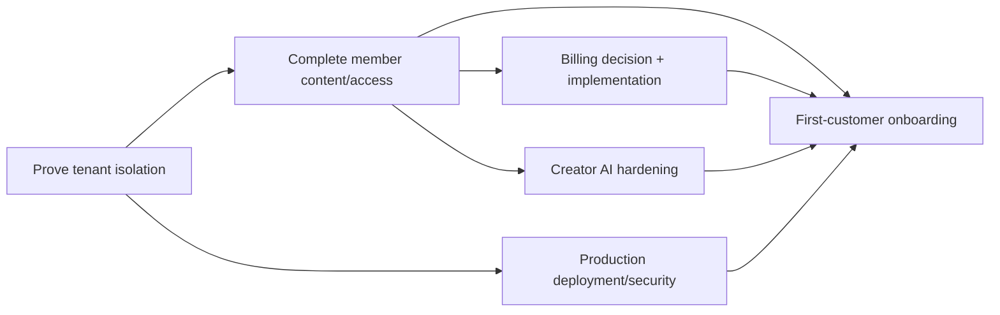

# 07 — Product Roadmap

**Purpose:** Sequence UpNexx delivery from current foundation to scalable product  
**Status:** Needs Validation  
**Last Updated:** 2026-07-28  
**Intended Audience:** Product, engineering, design, operations, sales, and investors

## Contents

1. [Phase roadmap](#phase-roadmap)
2. [Release scopes](#release-scopes)
3. [Deferred features](#deferred-features)
4. [Critical path](#critical-path)
5. [Definitions and risks](#definitions)

## Planning rules

No calendar dates are assigned. Effort categories are **S** (small), **M** (medium), **L** (large), and **XL** (multi-team/uncertain). Owners are placeholders. Status reflects repository evidence.

## Phase roadmap

| Order | Phase | Goal | Key scope | Dependencies | Risk | Acceptance criteria | Effort | Owner | Status |
| --- | --- | --- | --- | --- | --- | --- | --- | --- | --- |
| 1 | Foundation and branding | Establish credible product identity and engineering baseline | UpNexx identity, tokens, marketing site, auth shell, documentation | Product decisions | Brand drift | Approved brand, responsive shell, build/tests pass | M | `[Owner]` | **Implemented/Partial** |
| 2 | Multi-tenant platform core | Safely provision and isolate customers | tenants, roles, invitations, RLS, admin wizard, domains | Staging Supabase | Isolation defect | Multi-role RLS matrix passes; tenant creation audited | L | `[Owner]` | **Partial** |
| 3 | Content, learning, resources, events, community | Deliver the member-value core | media/video, content CRUD/storage, courses/modules/lessons, resources, events, community | Phase 2 | Incomplete authoring/access | Tenant can publish and member can consume allowed content | XL | `[Owner]` | **Partial** |
| 4 | Creator AI Studio and Member AI | Add grounded productivity and assistance | provider abstraction, generation, ingestion, RAG, citations, feedback | Phases 2–3, privacy | Hallucination/cost | Creator drafts are reviewed; member answers cite authorized sources | XL | `[Owner]` | **Creator partial; member planned** |
| 5 | Recommendations and AI Insights | Improve discovery and retention | member activity, recommendation baseline, admin insights | Quality activity data | Poor/creepy recommendations | Explainable, authorized recommendations outperform baseline | L | `[Owner]` | **Schema/Planned** |
| 6 | Commerce and billing | Monetize both product layers safely | tenant checkout, webhooks, portal, audience billing, credits, invoices | Stripe model decision | Financial/reconciliation error | Signed idempotent flows and access enforcement pass | XL | `[Owner]` | **Schema/Planned** |
| 7 | Enterprise features | Support larger organizations | SSO, advanced roles, audit export, SLA, governance, multi-brand | Proven demand | Premature complexity | Contracted requirements pass | XL | `[Owner]` | **Planned** |
| 8 | Marketing website and launch | Acquire and onboard first market | production site, proof, legal, support, analytics, launch gates | First-customer readiness | Claims exceed evidence | Launch checklist gates approved | L | `[Owner]` | **Partial** |
| 9 | Mobile and integrations | Extend reach and workflow connectivity | responsive hardening, PWA/native decision, email/calendar/CRM/API | Stable web contracts | Fragmentation | Prioritized integration has measurable adoption | XL | `[Owner]` | **Planned** |
| 10 | Marketplace and scale | Enable ecosystem and efficient growth | extension model, partner marketplace, multi-region/scale controls | Mature API/security | Ecosystem risk | Governance, review, billing, and reliability defined | XL | `[Owner]` | **Deferred** |

## Suggested work inside each phase

For every phase: confirm customer problem → document decision → threat/model data → implement smallest vertical slice → test roles/accessibility/failure → measure → update documentation.

## Release scopes

### Version 1.0 — first-customer readiness

- Reliable tenant creation, assignment, branding, and sign-in
- Proven RLS isolation and role enforcement
- Content upload/CRUD and polished member media view
- Basic course/resource/event/community delivery
- Audience membership definitions and enforced access
- Creator AI generation with one production-supported provider
- Operational email invitations/password reset
- Production deployment, custom domain for first customer, monitoring, backups
- Manual or test-mode billing process with documented owner
- Accessibility, security, legal, support, and onboarding gates

### Version 1.5

- Member RAG assistant with citations and feedback
- Robust course progress and basic quizzes
- Signed Stripe platform subscriptions and customer portal
- Audience billing decision implemented
- Recommendation baseline and improved analytics
- Email notifications and onboarding automation

### Version 2.0

- Administrator AI insights and retention workflows
- Advanced recommendations and learning paths
- Enterprise identity/governance where contracted
- Public API and priority integrations
- Multi-brand/multi-site capabilities

## Deferred features

Native mobile apps, marketplace, broad third-party automation, advanced video processing, SCIM, multi-region active-active, autonomous publishing, and unsupported compliance certifications.

## Critical path

## Definitions

**MVP:** One tenant can be securely onboarded, publish useful content, invite members, enforce access, and operate with a documented support/billing process.

**First-customer ready:** MVP plus production deployment, verified backups, monitoring, legal/support ownership, live RLS evidence, accessible critical flows, and a rehearsed onboarding/incident process.

## Risks

- Broad segment list dilutes Version 1.0.
- Schema breadth may be mistaken for workflow completeness.
- Billing and member AI carry higher security, trust, and support cost than their UI suggests.
- White-label/custom-domain operations may become manual bottlenecks.

## Open questions

- Which first customer defines acceptance criteria?
- Is billing mandatory before the first pilot or can it be managed manually?
- Which creator AI output delivers the earliest measurable value?
- What is the exit criterion from private beta?

## Related documents

[Product Vision](01_Product_Vision.md) · [Launch Checklist](09_Launch_Checklist.md) · [Testing and QA](14_Testing_and_Quality_Assurance.md)
