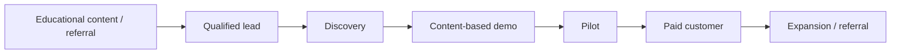

# 08 — Go-to-Market Strategy

**Purpose:** Define a validation-led path to first customers and repeatable growth  
**Status:** Needs Validation  
**Last Updated:** 2026-07-28  
**Intended Audience:** Founders, product, marketing, sales, partnerships, and customer success

## Contents

1. [Positioning and customers](#positioning)
2. [Differentiators and narrative](#differentiators)
3. [Packaging and pricing](#packaging-and-pricing)
4. [First-customer acquisition](#first-customer-acquisition)
5. [Funnel, proof, and metrics](#funnel-and-qualification)
6. [Risks and questions](#launch-risks)

## Positioning

UpNexx is **The Intelligent Content, Learning & Community Platform** for experts and organizations that need one branded destination for media, learning, community, events, memberships, and responsible AI.

It competes across creator membership, LMS, community, media/podcast member tools, and AI content-assistance categories. The sales narrative should emphasize the connected journey—not a checklist claiming to replace every specialist tool.

## Ideal customer profiles

### Primary pilot ICP

An expert-led business or organization with:

- an existing podcast/video/resource library;
- an identifiable audience and administrator;
- a recurring learning, community, or membership outcome;
- willingness to co-design and provide evidence;
- manageable migration and compliance requirements.

### Secondary segments

Educators/coaches, associations/nonprofits, churches/ministries, authors/speakers, and professional communities. Validate one repeatable wedge before segment-specific expansion.

## Buyer personas and use cases

| Buyer | Trigger | Use case | Proof required |
| --- | --- | --- | --- |
| Creator/founder | Audience growth without owned relationship | Media → membership journey | Faster setup, member engagement |
| Education/program lead | Scattered learning assets | Courses + resources + events | Completion and administrative control |
| Community/membership lead | Low retention | Content + discussion + recommendations | Returning members and participation |
| Executive/operations | Too many disconnected tools | Consolidated platform and governance | Lower complexity, trustworthy reporting |

## Differentiators

- Content-to-learning-to-community journey
- Tenant-branded member experience
- Separate and explicit platform versus audience economics
- BYO AI-provider direction and tenant metering
- Source-grounded, authorized member AI vision
- Nexx Jenn Technologies implementation and advisory relationship

Do not sell planned member AI, billing, analytics, or custom-domain automation as live without a scoped pilot statement.

## Messaging and sales narrative

1. You already have trusted expertise.
2. Your audience’s next step is fragmented.
3. UpNexx organizes content into an ongoing member journey.
4. Learning, community, events, memberships, and AI deepen value.
5. You gain an owned, branded environment and clearer insight.
6. Begin with one measurable use case and expand.

## Packaging and pricing

Platform plan concepts: **Creator, Growth, Professional, Enterprise, Trial, Complimentary, Custom**. Product logic and schema represent these tiers; pricing and limits are **proposed and require validation**.

Recommended packaging principles:

- gate by real cost/value drivers: members, administrators, storage, AI credits, domains, and support;
- keep core security and accessibility out of premium gates;
- use Enterprise/Custom only for genuinely bespoke requirements;
- define complimentary approval, expiration, and review policy;
- publish overage/fair-use terms before using “unlimited.”

## Trial and demo strategy

- Trial goal: reach activation—not passive browsing.
- Suggested activation: brand configured, first content published, first member invited.
- Guided demo: use customer content and show the member journey.
- Never require a live secret/API key during a sales demo.
- Use the AI at Work tenant only as demonstration evidence, not customer proof.

## First-customer acquisition

1. Select 10–20 warm prospects in one segment.
2. Conduct problem and workflow interviews.
3. Offer 2–3 tightly scoped design-partner pilots.
4. Import a small, representative content set.
5. Define baseline and target metrics before go-live.
6. Hold weekly feedback and issue triage.
7. Convert validated outcomes into a case study with consent.

### Pilot offer

- Defined onboarding scope and content limit
- Named admin and implementation owner
- Founding/complimentary price explicitly labeled
- Feedback cadence and success criteria
- Data, AI-provider, support, and exit terms
- No promise of roadmap items outside the agreement

## Funnel and qualification

Qualification: audience size and engagement, content readiness, problem urgency, decision maker, administrator capacity, budget, launch window, required integrations, security/legal needs, and willingness to measure results.

## Content and social plan

- Publish practical guidance on content-to-learning design, responsible member AI, retention, and membership economics.
- Repurpose founder/product learning into LinkedIn, email, webinars, and podcast/video.
- Show product workflows and customer outcomes rather than generic AI news.
- Build segment landing pages only after validated segment language.

## Partnerships

Potential partners: podcast producers, instructional designers, community strategists, associations, coaches, implementation consultants, payment/email specialists, and responsible-AI advisors. Define referral, implementation, data-access, and support boundaries before launch.

## Customer proof

- Activation time
- Member return rate
- Content completion and event registration
- Admin time saved on content repurposing
- AI draft acceptance/correction rate
- Free-to-paid conversion and retention once billing exists
- Qualitative member/admin testimonials with consent

## Metrics

Lead-to-discovery, discovery-to-demo, demo-to-pilot, pilot activation, pilot-to-paid, time to first value, CAC, expansion, MRR, gross retention, churn, AI cost per active tenant, and support burden.

## Launch risks

- Marketing planned features as implemented
- Targeting too many segments at once
- Pricing before understanding support and AI cost
- Using prototype metrics as customer proof
- Weak onboarding creating false product-market signals

## Open questions

- Who is the first segment, buyer, and design partner?
- What is the approved pilot price and scope?
- Which measurable outcome earns the first case study?
- Who owns sales, implementation, and ongoing customer success?

## Related documents

[Product Vision](01_Product_Vision.md) · [Roadmap](07_Product_Roadmap.md) · [Launch Checklist](09_Launch_Checklist.md) · [Subscription Model](11_Subscription_and_Membership_Model.md)
