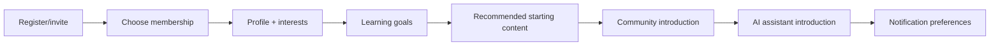

# 10 — Customer Onboarding

**Purpose:** Define onboarding for tenant organizations and their audience members  
**Status:** In Review  
**Last Updated:** 2026-07-28  
**Intended Audience:** Implementation, customer success, platform administrators, tenant administrators, and product

## Contents

1. [Platform-level tenant onboarding](#a-platform-level-tenant-onboarding)
2. [Tenant checklist](#tenant-onboarding-checklist)
3. [Audience-member onboarding](#b-audience-member-onboarding)
4. [Success and responsibilities](#member-success-criteria)

## A. Platform-level tenant onboarding

The platform-admin wizard currently supports organization, platform subscription, features, branding, audience membership template, administrator invitation, and review. Custom-domain operations, email delivery, billing execution, AI training, and launch review remain partial or manual.

| Stage | Activities | Responsible | Timing | Success criterion |
| --- | --- | --- | --- | --- |
| Discovery | Goals, audience, content, workflows, security, success metrics | UpNexx + customer | `[Set]` | Signed scope and named owners |
| Organization setup | Name, slug, tenant type, status | Platform admin | `[Set]` | Tenant exists and resolves |
| Platform subscription | Creator/Growth/Professional/Enterprise/Trial/Complimentary/Custom | Commercial + platform admin | `[Set]` | Correct plan/status/allowance |
| Feature entitlements | Enable contracted modules and limits | Platform admin | `[Set]` | Entitlements match agreement |
| Branding | Logo, colors, copy, footer, preview | Customer + implementation | `[Set]` | Approved accessible tenant preview |
| Custom domain | Domain ownership, DNS, SSL, canonical URL | Customer IT + operations | `[Set]` | Verified HTTPS route; currently manual/planned |
| Admin invitation | Invite, confirm, assign owner/admin roles | Platform admin | `[Set]` | Admin signs in and signs out |
| Membership template | Free/Premium/VIP/custom plans and access | Customer + implementation | `[Set]` | Plans and rules approved |
| Content import | Representative episodes, courses, resources, events | Customer + content manager | `[Set]` | Content opens in correct member tiers |
| AI setup | Provider, key ownership, model, credits, sources, policy | Customer admin + security | `[Set]` | Creator generation test passes |
| Email setup | Sender/domain, invitation/reset templates | Operations | `[Set]` | Delivery and SPF/DKIM/DMARC pass; planned |
| Billing setup | Platform and audience billing responsibilities | Finance + operations | `[Set]` | Test or manual reconciliation passes |
| Training | Admin navigation, CRUD, member preview, AI, support | Customer success | `[Set]` | Admin completes scenario checklist |
| Launch review | Security, content, access, domain, support, rollback | All owners | `[Set]` | Go-live gate signed |
| Go-live | Enable agreed access and communications | Operations | `[Set]` | Members can register and consume |
| 30-day check-in | Activation, usage, issues, outcomes, next scope | Customer success | 30 days after launch | Improvement plan agreed |

### Tenant onboarding checklist

- [ ] Discovery and data/content inventory completed
- [ ] Tenant type, slug, plan, features, and owner approved
- [ ] Branding passes accessibility review
- [ ] Domain and redirects verified where included
- [ ] Admin invite and password recovery tested
- [ ] Membership/access matrix tested with representative users
- [ ] Content links, files, video, dates, and thumbnails verified
- [ ] AI terms, provider, key, credits, review, and support agreed
- [ ] Billing and email method verified or manual owner named
- [ ] Training, launch review, rollback, and 30-day meeting scheduled

## B. Audience-member onboarding

### Recommended stages

1. **Registration:** email confirmation, accessible password/recovery, consent.
2. **Membership selection:** clear price, benefits, trial, cancellation, and access.
3. **Profile:** collect only necessary data; optional fields remain optional.
4. **Interests/content preferences:** explain how selections affect recommendations.
5. **Learning goals:** short, skippable, editable.
6. **Recommended content:** show a small authorized starting path and “why.”
7. **Community introduction:** norms, privacy, reporting, and first low-friction action.
8. **AI assistant introduction:** capability, citations, limitations, privacy, credits, feedback.
9. **Notifications:** channel, frequency, and unsubscribe controls.

Current repository support is **partial**: authentication and member/demo experiences exist; membership checkout, preference capture, personalization, notifications, and production member AI remain planned.

### Member success criteria

- Member knows what access they have and how to change/cancel it.
- Member reaches a useful piece of content quickly.
- Member completes one meaningful action.
- Preferences can be changed.
- AI is introduced only when authorization/citations are ready.
- Support and account deletion/export paths are discoverable.

### Responsibilities

- **UpNexx:** platform security, availability, core accessibility, platform support.
- **Tenant:** content accuracy, community policy, member support boundary, pricing, lawful data use.
- **Member:** accurate account information, policy compliance, credential safety.
- Contractual responsibilities require legal approval.

## Open questions

- Which onboarding steps are required versus skippable?
- Who provides first-line member support?
- What content-import volume is included by plan?
- Which onboarding events will be measured?

## Related documents

[Launch Checklist](09_Launch_Checklist.md) · [Subscription Model](11_Subscription_and_Membership_Model.md) · [Security](12_Security_and_Privacy.md)
