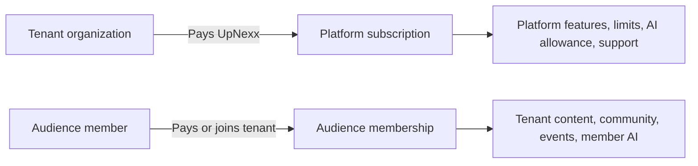
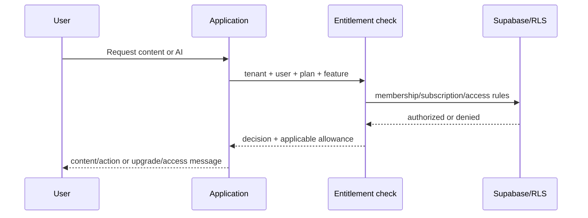

# 11 — Subscription and Membership Model

**Purpose:** Keep UpNexx platform billing separate from tenant audience memberships  
**Status:** In Review  
**Last Updated:** 2026-07-28  
**Intended Audience:** Product, finance, engineering, sales, customer success, and tenant administrators

## Contents

1. [The two layers](#the-two-layers)
2. [Platform plans](#platform-plans)
3. [Audience memberships](#audience-membership-examples)
4. [Entitlements and AI allowances](#entitlements-and-enforcement)
5. [Billing lifecycle and Stripe](#billing-lifecycle)
6. [Reporting and edge cases](#reporting-and-audit)

## The two layers

| Question | Platform subscription | Audience membership |
| --- | --- | --- |
| Buyer | Tenant organization | Tenant’s audience member |
| Seller | UpNexx/Nexx Jenn Technologies | Tenant |
| Tables | `platform_plans`, `tenant_subscriptions`, entitlements | `tenant_membership_plans`, `member_subscriptions`, access rules |
| Purpose | Access to operate UpNexx | Access to tenant experiences |
| Revenue owner | UpNexx | Tenant, subject to payment model |

These concepts must never be merged in UI labels, database records, support scripts, invoices, or analytics.

## Platform plans

Creator, Growth, Professional, Enterprise, Trial, Complimentary, and Custom are represented in product logic and/or subscription configuration. Current prices and limits are **proposed and require validation**; Stripe execution is not implemented.

Typical entitlement dimensions:

- member/admin limits;
- content/course/community/event limits;
- storage and custom domains;
- creator/member AI features and credits;
- analytics, branding attribution, integrations, and support.

### Trial, complimentary, and custom

- **Trial:** explicit start/end, conversion behavior, data/access after expiry.
- **Complimentary:** approved reason, owner, review/expiry, zero platform charge, normal security controls.
- **Custom:** signed price, billing frequency, entitlements, support, limits, and renewal.

## Audience membership examples

Free, Premium, VIP, course membership, coaching program, nonprofit and faith-based organization, association membership, and Custom. The nonprofit and faith-based template begins with Community Member, Supporter, and Leadership. Generated plans are tenant-owned editable starting points with template provenance, benefits, color, display order, and active state; they are not permanent shared records.

An audience plan may define:

- monthly/annual price and currency;
- trial days;
- community and AI access;
- AI monthly allowance;
- member visibility/invite-only behavior;
- content access rules and tenant-specific benefits.

## Entitlements and enforcement

Enforce access server-side and in RLS—not only by hiding controls. Feature flags and tenant overrides must be auditable and must not grant cross-tenant access.

## AI allowances and packages

- Platform plan allowance controls tenant-level capacity.
- Tenant override may support contractual/custom capacity.
- Audience plan allowance controls member-facing AI where enabled.
- Usage records and credit transactions should be idempotent and reconcilable.
- Additional credit packages are **planned** and require pricing, expiry, refund, and tax decisions.

## Billing lifecycle

### Recommended behavior

- **Upgrade:** define immediate versus next-cycle entitlement and proration.
- **Downgrade:** preserve access through paid period; warn before content/features become unavailable.
- **Cancellation:** record effective date; do not delete content automatically.
- **Grace period:** define duration, retry communications, and read/write restrictions.
- **Reactivation:** restore entitlements without duplicating subscriptions.
- **Refund/chargeback:** audit financial and access changes.

No behavior should be claimed as implemented until signed webhook and access tests exist.

## Stripe relationship

Schema and application routes keep both layers separate. Stripe checkout, customer portal, Connect Standard onboarding, signed idempotent platform/connected-account webhooks, reconciliation fields, and access updates are implemented. Live keys, Prices, webhook registration, taxes/refunds policy, and controlled production transactions still require operator validation.

Required decisions:

- one UpNexx account versus Stripe Connect for tenant audience revenue;
- merchant of record, fees, taxes, refunds, and support;
- product/price ownership and synchronization;
- idempotency, event ordering, reconciliation, and failed-payment handling.

## Reporting and audit

Report platform MRR separately from tenant audience revenue. Track plan/status transitions, manual overrides, complimentary approvals, entitlement changes, AI credit transactions, provider events, and actor/reason in audit logs.

## Edge cases

- One user administers or belongs to multiple tenants.
- One tenant operates multiple podcasts/programs under one subscription.
- Member belongs to multiple audience plans.
- Complimentary tenant uses paid AI/provider resources.
- Plan downgrade conflicts with stored content/member volume.
- Webhook arrives late, duplicated, or out of order.
- Payment succeeds but entitlement write fails.
- Member cancels while retaining manually granted access.
- Tenant is suspended while members have paid time remaining.

## Open questions

- Which platform prices and limits are approved?
- Who is merchant of record for audience memberships?
- Are multiple simultaneous audience plans allowed?
- How are taxes, refunds, credits, and chargebacks handled?

## Related documents

[Product Vision](01_Product_Vision.md) · [Database Design](04_Database_Design.md) · [Security](12_Security_and_Privacy.md) · [Decision Log](16_Decision_Log.md)
