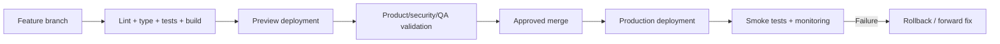

# 13 — Deployment and Environment Setup

**Purpose:** Document safe local setup and the intended preview/production deployment workflow  
**Status:** In Review  
**Last Updated:** 2026-07-28  
**Intended Audience:** Developers, DevOps, technical operators, and implementation partners

## Contents

1. [Local setup and environment](#local-setup)
2. [Supabase and vendor setup](#supabase)
3. [Vercel and deployment flow](#vercel-configuration)
4. [Domains and DNS](#domains-and-dns)
5. [Rollback, monitoring, and troubleshooting](#rollback-and-recovery)

## Current deployment status

The application builds as a Vercel-compatible Next.js application. No production deployment is evidenced or performed by this documentation change. Vercel is the intended direction; Cloudflare DNS and production domain routing are planned.

## Required software

- Current Node.js LTS and npm
- Git
- Supabase project and SQL Editor/CLI access
- Browser for local verification
- Optional provider/vendor accounts only for features being tested

## Local setup

```powershell
git clone <repository-url>
cd creator-community-ai
npm install
Copy-Item .env.example .env.local
npm run dev
```

Open `http://localhost:3000`. The project’s `scripts/dev-server.mjs` keeps the development server single-instance.

Do not run `npm run build` while `next dev` is running because both use `.next`; stop development first, build, then restart.

## Environment variables

| Variable | Scope | Purpose | Status |
| --- | --- | --- | --- |
| `NEXT_PUBLIC_SUPABASE_URL` | Public | Supabase project URL | Required |
| `NEXT_PUBLIC_SUPABASE_ANON_KEY` | Public | RLS-bound browser/server key | Required |
| `SUPABASE_SERVICE_ROLE_KEY` | Server secret | Trusted administrative workflows | Required for platform administration |
| `APP_ENCRYPTION_KEY` | Server secret | Encrypt tenant AI keys | Required for BYO AI |
| `NEXT_PUBLIC_APP_URL` | Public | Application origin | Required |
| `NEXT_PUBLIC_ROOT_DOMAIN` | Public | Hosted tenant-domain resolution | Needs update/validation for UpNexx |
| Stripe variables | Server/public as named | Billing | Placeholder; integration planned |
| `RESEND_API_KEY`, `EMAIL_FROM` | Server | Transactional email | Placeholder; integration planned |

Use platform environment settings or `.env.local`; never commit actual values. The current example root domain still requires a migration decision from the legacy placeholder to the approved domain model.

## Supabase

1. Create/select the correct project.
2. Apply migrations `0001` through `0008` in order.
3. Verify extensions, tables, functions, RLS, policies, indexes, and `tenant-assets`.
4. Configure auth site URL and allowed redirect URLs for local, preview, and production.
5. Reconcile generated TypeScript types.
6. Run the staging RLS/tenant-isolation matrix.

Do not expose the service-role key to browser code.

## Vendor setup status

- **Stripe:** configure only after billing model approval; SDK/routes/webhooks are not implemented.
- **Resend:** configure domain, sender, and templates after email integration exists.
- **AI providers:** tenant-owned keys are entered at Organization Settings → Integrations → AI Providers; never add customer keys to environment variables or documentation.
- **Sentry/PostHog:** recommended, not installed.

## Commands

```powershell
npm run dev
npm run lint
npm run typecheck
npm test
npm run test:coverage
npm run test:e2e
npm run build
npm start
```

## Vercel configuration

Recommended defaults:

- Framework preset: Next.js
- Root directory: repository directory containing `package.json` and `app`
- Install: `npm install`
- Build: `npm run build`
- Output: automatic Next.js output
- Node version: current supported LTS matching local/CI
- Environment variables: separately configured for preview and production

### “Couldn't find any pages or app directory”

Likely causes:

1. Vercel root directory points above/below the Next.js application.
2. Application is stored in a subfolder but root is not set to it.
3. `app` or `pages` was not committed/pushed.
4. The wrong repository or branch was selected.
5. Build settings override the framework/root incorrectly.

Confirm the selected deployment commit contains `package.json`, `next.config.ts`, and `app/layout.tsx` under the configured root. Do not “fix” this by copying secrets or moving production files without understanding the repository layout.

## Deployment flow



Preview deployments must use non-production or carefully isolated data and valid Supabase redirect URLs.

## Domains and DNS

Approved product domain: `upnexx.net`.

Proposed roles requiring validation:

- `www.upnexx.net` — marketing site
- `app.upnexx.net` — authenticated platform
- `{tenant}.upnexx.net` or custom domains — tenant experiences

Cloudflare may provide DNS/edge protection while Vercel hosts the application. Configure CNAME/A records according to vendor instructions, verify ownership, enable SSL, set canonical redirects, and add SPF/DKIM/DMARC for email. Never guess DNS target values.

## Rollback and recovery

- Keep previous deploy available for application rollback.
- Treat database migrations separately; prefer forward-compatible additive changes.
- Record deploy, migration, environment, and incident ownership.
- Smoke test landing, auth, tenant routing, content, member access, AI, and billing if enabled.
- Verify backup/restore rather than relying on configuration alone.

## Monitoring

**Recommended:** Vercel runtime metrics, Sentry errors/traces, uptime checks, Supabase health/capacity, structured logs, AI-provider latency/cost, Stripe webhook/reconciliation, and consent-aware PostHog funnels.

## Troubleshooting

| Symptom | Check |
| --- | --- |
| Unstyled/giant SVG page | Stale dev process or CSS chunk 404 after building during dev; restart server |
| `fetch failed` during login | Supabase reachability and server network permissions |
| Route 404 | Correct App Router path, commit, and Vercel root |
| Tenant missing | domain/slug record, membership, resolver order, and migration state |
| Content schema error | migrations 0004/0005 applied and schema cache refreshed |
| AI key error | encryption key format/stability and server-only environment |

## Open questions

- Are Vercel and Cloudflare formally approved?
- Which subdomain model is canonical?
- Which CI system and protected-branch rules will be used?
- What are production RPO/RTO and rollback authority?

## Related documents

[System Architecture](03_System_Architecture.md) · [Security](12_Security_and_Privacy.md) · [Testing and QA](14_Testing_and_Quality_Assurance.md)
